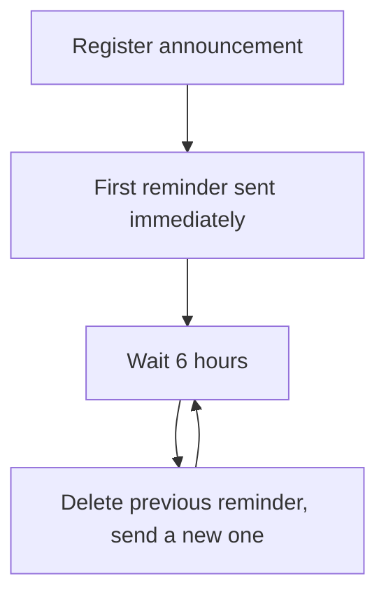
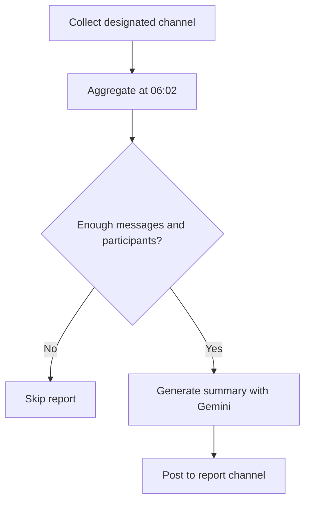

# eslee Discord Bot

A server management bot that automates repeated announcement reminders,
forbidden-word moderation, and daily conversation summaries for Discord
servers.

**Language:** English · [한국어](README.md)

> This bot is privately operated and provides no public invite link. To use
> it, follow [Deploying your own instance](#deploying-your-own-instance) to run
> it under your own Discord bot application, then invite that bot to your own
> server. The GitHub source ZIP is not a ready-to-run installer.

## What this bot can do for you

- Re-announce important messages **every 6 hours** so they never get buried
- Turn an existing message into an announcement **with one right click**
- Register dozens of forbidden words **in one command**, and catch spaced-out
  or decomposed evasions like `주.식`, `주 식`, and `ㅈㅜㅅㅣㄱ`
- Catch users who **edit a clean message afterwards** to sneak a banned word in
- Receive an **automatic morning report** summarizing yesterday's conversation
- Keep schedules and summary work **from restarting at zero** when the bot
  process restarts

## Getting started

The full path from deployment to your first announcement:

1. Follow [Deploying your own instance](#deploying-your-own-instance) to run
   the bot locally, in Docker, or on Northflank.
2. Invite the bot to your server using the invite link you create in the
   Discord Developer Portal.
3. Check that the bot shows as **online** in the member list.
4. Type `/` in the chat box and confirm the `/공지` and `/금지어` commands
   appear. Right after inviting, commands can take a few minutes to show up.
5. As an administrator, try your first feature:
   - Right-click any message (long-press on mobile) → **Apps → 공지로 등록**
     ("register as announcement")
   - Or register a test word with `/금지어 추가` and then post that word
6. Point admin logs at a channel with `/설정 로그채널`, and you are set.

The daily summary is an opt-in feature that does not turn on by inviting the
bot. It works only when the operator deploying the bot designates a target
server and channel through environment variables. See
[Daily conversation summary](#daily-conversation-summary).

Note: all commands and bot responses are in Korean.

## Announcement reminders

Keeps an important message in its original place and re-announces it to the
channel every 6 hours.

### Registering an announcement

- Existing message: right-click the message and choose **Apps → 공지로 등록**.
- New announcement: use `/공지 등록` and type the text into the `content`
  option; the optional `channel` option chooses where the source message is
  posted (default: the channel you ran the command in).

The first reminder is sent immediately after registration, then every 6 hours.

### How reminders behave

- Each new reminder **deletes only the previous reminder**. The original
  announcement message is never deleted or pinned.
- Every reminder carries a jump link to the original. Short texts are
  readable inside the reminder; long texts are shortened to a preview.
- Images and files are never re-uploaded; the reminder points to the original
  attachments, so the same file does not pile up in the channel.
- Edits to the original message are reflected in later reminders.
- If the original message is deleted, the announcement is automatically
  disabled, with a note in the log channel when one is configured.
- Reminders missed while the bot was offline are not sent in a burst — each
  announcement is re-announced once, then returns to its normal cycle.



### Poll announcements

Registering a message that contains a Discord Poll does not create a new
poll — cloning would split existing votes. Instead the reminder shows the
original poll's question, status, and remaining time, and directs members to
the original. After the end time it shows `종료됨` (ended), and participant
counts that cannot be computed reliably are never guessed.

### Managing announcements

| Goal | Command |
| --- | --- |
| See active announcements | `/공지 목록` |
| Re-announce right now | `/공지 즉시전송` (pick via autocomplete) |
| Delete an announcement | `/공지 삭제` (pick via autocomplete) |

## Forbidden-word moderation

Register words that must not be used on your server; new and edited messages
are checked in real time.

### Managing the word list

- `/금지어 추가` — add one word.
- `/금지어 일괄추가` — add up to 500 words at once, separated by commas or
  line breaks, e.g. `사과, 바나나, TEST`.
- `/금지어 삭제` — delete via the autocomplete list.
- `/금지어 목록` — view the current server's words. **The only management
  command open to every member**, so anyone can check the server rules.

Matching ignores letter case, and duplicate entries are merged
automatically.

### How detection works

The base rule is substring matching: registering `사과` also catches
`청사과` and `사과나무`.

Common evasions are caught as well. With `주식` registered, forms like
`주.식`, `주123식`, `주 식`, `주ㅋㅋ식`, invisible-character insertion, and
decomposed jamo such as `ㅈㅜㅅㅣㄱ` are detected. The filler allowed between
letters is limited to spaces, symbols, digits, and short `ㅋ/ㅎ` runs, with a
bounded length — so a normal sentence like `주말에 맛있는 식당에 갔다`, where
real words sit between the letters, is not stitched together into a false
match.

Messages from bots and webhooks are not inspected, so the bot never re-detects
its own warnings.

### What happens on a violation

1. The violating message is deleted.
2. A warning mentioning the author appears in the same channel and
   auto-deletes after about 5 seconds. No DM is sent.
3. If a log channel is set via `/설정 로그채널`, an admin record is posted
   there with the user, channel, detected words, whether deletion succeeded,
   and a preview of the original text.

Multiple banned words in one message still produce a single deletion and a
single warning, with every detected word recorded. Detection and deletion keep
working even when no log channel is configured or reachable.

## Daily conversation summary

An **opt-in feature** that collects one channel's conversation and publishes a
Gemini-generated summary report the next morning.

### Before you rely on it

- It is not automatically available on every server. It works only for the
  **one server and one channel** the bot operator designates via environment
  variables.
- It requires a Google Gemini API key, and the target channel's text is sent
  to Google Gemini to generate the summary.

### How it works

- Only **human-authored text** in the designated channel is collected. Bot,
  webhook, and system messages, empty messages, and attachment-only messages
  are excluded.
- Edits are reflected; deleted messages are removed from the summary source.
- Every day at 06:02 (default), messages from 06:00 the previous day to 06:00
  today are aggregated. A report is generated only when there are at least
  10 messages from 2 participants (defaults).
- The report contains an overall summary plus one-line summaries for up to 20
  members (default) who wrote 3 or more messages. Message counts, participant
  counts, and the busiest hour are computed by the bot itself, not the AI.
- Only the finished report is posted publicly, to the designated report
  channel.
- After a restart the bot re-reads missed history in the background, and a
  missed morning run is caught up automatically as long as no completed
  report exists.
- Collected raw text is deleted after 3 days by default; generated reports
  and statistics are kept.



### Administrator commands

These commands work only for the owner/administrators of the designated
server, and responses are visible only to the person who ran them.

| Command | What it does |
| --- | --- |
| `/하루요약 상태` | Show configuration, today's collection, latest report status, and usage diagnostics |
| `/하루요약 오늘` | Generate a preview of today so far (refresh with the `재생성` option) |
| `/하루요약 어제` | Repost yesterday's report; an existing completed report is copied without another AI call |
| `/하루요약 연결확인` | Privately check Gemini authentication and model access without exposing the key |

### Built to stay inside the free tier

A short day is usually summarized with **a single Gemini request**. Very long
days are summarized in parts and then combined, still under a per-report
request cap (8 requests for automatic runs, 12 including manual commands). On failure
or quota exhaustion the bot does not hammer the API every minute — it retries
only after defined cooldowns, and once the quota resets it automatically
finishes any incomplete report. Successful partial results are saved and
reused, so the same work never spends quota twice. On a quota-exhausted day
the report may arrive later in the afternoon, but it is not lost.

Operator-facing environment variables and the detailed policy live in the
[daily summary operations guide](docs/daily-summary.md) (Korean).

## Commands at a glance

| When you want to… | Command | Who can use it |
| --- | --- | --- |
| Turn an existing message into a repeated announcement | Right-click → **Apps → 공지로 등록** | Owner/Admin |
| Write a new announcement | `/공지 등록` | Owner/Admin |
| List, delete, or re-send announcements | `/공지 목록` · `삭제` · `즉시전송` | Owner/Admin |
| Add one forbidden word | `/금지어 추가` | Owner/Admin |
| Add many forbidden words | `/금지어 일괄추가` | Owner/Admin |
| Delete a forbidden word | `/금지어 삭제` | Owner/Admin |
| View the server's forbidden words | `/금지어 목록` | **Every member** |
| Set the admin log channel | `/설정 로그채널` | Owner/Admin |
| Summary status, preview, repost | `/하루요약 상태` · `오늘` · `어제` · `연결확인` | Owner/Admin of the designated server + operator setup |

"Owner/Admin" means the server owner or a member with Discord's Administrator
permission. Management responses are visible only to the invoker, and members
without permission only receive a denial notice. The bot account itself does
not need Administrator.

## Good to know

- The bot needs View Channels, Send Messages, Manage Messages, Read Message
  History, and Embed Links. Channel-level permission overrides can break
  deletion or reminders in that channel.
- Forbidden-word detection requires the **Message Content Intent** to be
  enabled in the Discord Developer Portal.
- Commands and responses are in Korean.
- The daily summary works only for the operator-designated server and channel,
  and needs a Gemini API key and outbound API access. Reports can be delayed
  on days the free quota is exhausted.
- Poll reminders link to the original poll and never clone it, so votes always
  accumulate in one place.
- Running the same bot token in two places duplicates reminders. Keep exactly
  one instance running.
- Discord or Google API outages can temporarily delay reminders and reports.

## Data and privacy

What the bot stores:

- Per-server settings (log channel), announcement schedules and content
  snapshots, forbidden-word lists
- Violation records: server, user, and channel IDs, detected words, and the
  time — **the original message body is not stored**
- Message text from the daily-summary channel: **kept 3 days by default, then
  deleted**; generated reports and statistics are kept

What appears in channels:

- On a violation, the admin log channel shows a preview of the original
  message. Use a channel restricted to administrators.

What leaves your server:

- Only when the daily summary is enabled, the designated channel's message
  text, author display names, and timestamps are sent to the Google Gemini
  API to generate the summary. Attachments are never collected, so none are
  sent.
- No ads, analytics, or any other outbound transfer.

Data lives in the operator-configured database (a local SQLite file or
PostgreSQL). Application logs do not record tokens or message bodies. When
sharing logs for a bug report, mask server, channel, and user IDs.

## Troubleshooting

### Slash commands do not appear

→ Confirm the invite included both the `bot` and `applications.commands`
scopes.
→ Right after inviting, commands can take minutes up to about an hour to
propagate. Restart the Discord app.
→ If they still do not appear, kick the bot and re-invite with both scopes.

### Announcement reminders stop arriving

→ Check `/공지 목록` to see the announcement is still active. Deleting the
original message disables it automatically.
→ Check the bot can view and send messages in that channel.
→ Check the bot is online. After downtime, missed reminders are re-sent once,
not in a burst.
→ If it keeps failing, check the runtime logs for send errors.

### A forbidden word is not detected

→ Check `/금지어 목록` on **this server** — word lists are per server.
→ Confirm the Message Content Intent is enabled in the Developer Portal.
→ Messages from bots and webhooks are intentionally not inspected.
→ Evasion detection is bounded by design. If you need a specific variant
caught, register that variant as its own word.

### The daily report is not posted

→ Start with `/하루요약 상태` — it shows whether the feature is enabled,
today's collection count, the latest report status, and usage diagnostics.
→ If yesterday's conversation was below the minimum (default: 10 messages,
2 participants), skipping the report is normal.
→ Use `/하루요약 연결확인` to check the Gemini key and model access.
→ On quota-exhausted days the report is posted automatically after the quota
resets; the status command shows when the wait ends.
→ If it keeps failing, check the runtime logs in your deployment (Northflank
etc.).

### Database connection fails

→ Check `DATABASE_URL`. `postgresql://` and `postgres://` URLs are converted
to the async driver automatically, and `sslmode=require` is handled for you.
→ On Northflank, confirm the PostgreSQL addon's `POSTGRES_URI` is aliased to
the service as exactly `DATABASE_URL`.

### The bot is offline

→ Confirm the runtime (Northflank deployment, local process, Docker
container) is actually running.
→ Check the startup logs for token or configuration validation errors —
invalid required values make the bot exit with a readable reason.
→ Confirm the latest code is deployed and the instance count is 1.

## How it works

- Announcement schedules are stored in the database, so a restart never
  resets the 6-hour cycle; the stored next-send time is honored.
- Forbidden-word checks run on new-message and message-edit events.
- The daily summary stores the designated channel's text temporarily,
  aggregates it at the scheduled time, and saves completed partial AI work so
  a mid-run failure resumes instead of restarting. Completed reports are
  never regenerated.
- Per-server data (announcements, words, settings, violations) is isolated
  per server.

## Deploying your own instance

Everything from here on is for operators and developers. Python 3.12+ is
required.

### 1. Clone and install

```bash
git clone https://github.com/esleeeeee/eslee-discord-bot.git
cd eslee-discord-bot
python -m venv .venv
source .venv/bin/activate
python -m pip install -e ".[dev]"
cp .env.example .env
```

On Windows PowerShell, use `.venv\Scripts\Activate.ps1` and
`Copy-Item .env.example .env`.

### 2. Discord Developer Portal

1. Create an application at the
   [Discord Developer Portal](https://discord.com/developers/applications) and
   create the bot user under **Bot** to get the token.
2. Enable **Message Content Intent** under Privileged Gateway Intents.
   Presence and Server Members are not needed.
3. Keep **Public Bot** off for a private deployment.
4. In **OAuth2 → URL Generator**, select the `bot` and
   `applications.commands` scopes and only these permissions:
   - View Channels, Send Messages, Manage Messages,
     Read Message History, Embed Links
5. Invite the bot with that URL. Do not grant Administrator.

### 3. Environment variables

Set these in `.env`. Never commit real tokens or keys — this repository
gitignores `.env`, the SQLite DB, and log files.

```env
DISCORD_TOKEN=your_discord_bot_token
DATABASE_URL=sqlite+aiosqlite:///./data/eslee_bot.db
```

| Variable | Required | Default | Purpose | Sensitive |
| --- | --- | --- | --- | --- |
| `DISCORD_TOKEN` | Yes | — | Bot token | Yes |
| `DATABASE_URL` | No | local SQLite file | SQLite or PostgreSQL connection URL | Yes for PostgreSQL |
| `LOG_LEVEL` | No | `INFO` | Log level | No |
| `SCHEDULER_POLL_SECONDS` | No | `60` | Schedule poll interval (10–300s) | No |
| `DISCORD_DEV_GUILD_ID` | No | empty | Local development only: instant command sync to one test server | No |
| `DAILY_SUMMARY_ENABLED` | No | `false` | Turn the daily summary on | No |
| `DAILY_SUMMARY_GUILD_ID` | When summary on | empty | Target server ID | No |
| `DAILY_SUMMARY_SOURCE_CHANNEL_ID` | When summary on | empty | Channel to collect | No |
| `DAILY_SUMMARY_REPORT_CHANNEL_ID` | When summary on | empty | Channel for reports | No |
| `GEMINI_API_KEY` | When summary on | empty | Google Gemini API key | Yes |
| `DAILY_SUMMARY_AI_MODEL` | No | `gemini-3.5-flash` | Gemini model | No |
| `DAILY_SUMMARY_TIMEZONE` | No | `Asia/Seoul` | Day-boundary timezone | No |
| `DAILY_SUMMARY_RUN_TIME` | No | `06:02` | Automatic report time (HH:MM) | No |
| `DAILY_SUMMARY_RAW_RETENTION_DAYS` | No | `3` | Raw text retention days (1–30) | No |
| `DAILY_SUMMARY_MIN_TOTAL_MESSAGES` | No | `10` | Minimum messages for a report | No |
| `DAILY_SUMMARY_MIN_PARTICIPANTS` | No | `2` | Minimum participants | No |
| `DAILY_SUMMARY_MIN_USER_MESSAGES` | No | `3` | Minimum messages for a personal summary | No |
| `DAILY_SUMMARY_MAX_USERS` | No | `20` | Max members in personal summaries (1–100) | No |
| `ONEKEY_DISCORD_USER_ID` | Optional pair | empty | User whose voice presence the OneKey API reports | Yes |
| `ONEKEY_API_TOKEN` | Optional pair | empty | OneKey API bearer token (32+ chars, no padding) | Yes |
| `PORT` | No | `8080` | OneKey API HTTP port | No |

`ONEKEY_DISCORD_USER_ID` and `ONEKEY_API_TOKEN` must be set together; a token
shorter than 32 characters or padded with whitespace is rejected at startup.

### 4. Run

```bash
python -m eslee_bot
```

The first run creates the `data/eslee_bot.db` SQLite file and its tables.
Invalid required settings produce a readable startup error that does not
expose secrets.

For an optional Windows login task, use
`scripts/install_scheduled_task.ps1` — but only for a local-only deployment,
because running the same token elsewhere duplicates reminders.

### 5. Docker

```bash
cp .env.example .env
# put the token in .env, then:
docker compose up --build -d
docker compose logs -f bot
```

The container runs as a non-root user, and SQLite data persists in the
`bot-data` volume.

### 6. Northflank

Northflank's Developer Sandbox free services and free PostgreSQL addon can
run the bot 24/7. Free-tier terms can change; check the
[pricing docs](https://northflank.com/docs/v1/application/billing/pricing-on-northflank).

1. Create a project and a free **PostgreSQL addon**.
2. In **Secrets → Create secret group**, link the addon and alias its
   `POSTGRES_URI` to exactly `DATABASE_URL`.
3. Add `DISCORD_TOKEN` to the same group — plus the `DAILY_SUMMARY_*`
   variables and `GEMINI_API_KEY` if you use the summary. All of these must be
   **runtime variables**, not build arguments.
4. Create a **Combined Service** from this repository's `main` branch with
   build type **Dockerfile** (path `/Dockerfile`) and instance count **1**.
5. Leave ports unset unless you use the OneKey API — see
   [the OneKey section](#7-onekey-voice-status-api-optional).
6. Watch the deploy logs for `Database initialized` and the Discord login.

Northflank's `postgresql://` URI is normalized to the async driver at
runtime, and `sslmode=require` is translated to the proper TLS option.

Local SQLite data is not migrated automatically. To move it, follow the
[SQLite → PostgreSQL migration guide](docs/sqlite-to-postgres-migration.md)
(Korean) and stop both bots during the migration.

### 7. OneKey voice status API (optional)

A small HTTP API in the same process that answers exactly one question:
whether a designated user is currently in a voice channel. It exists for the
author's Windows program (eslee OneKey) to decide when it is safe to restore
audio devices after a game closes.

- `GET /health` — process and Discord readiness, no authentication
- `GET /api/voice-status` — requires `Authorization: Bearer <token>` and
  returns only `{"in_voice": true|false}`; never the server or channel

Enable it by setting `ONEKEY_DISCORD_USER_ID` and `ONEKEY_API_TOKEN`
together. On Northflank, expose `PORT` (default 8080) as an HTTP public port
with `/health` as the health check. Servers the bot is not in, and DM calls,
are out of scope.

### 8. Lint and test

```bash
python -m ruff check .
python -m pytest
```

GitHub Actions runs the same checks on every push and pull request.

## Documentation

- [Daily summary operations guide](docs/daily-summary.md) (Korean) —
  environment variables, permissions, privacy, quota policy, failure handling
- [SQLite → PostgreSQL migration guide](docs/sqlite-to-postgres-migration.md)
  (Korean)
- [CHANGELOG](CHANGELOG.md)
- Bug reports and suggestions:
  [GitHub Issues](https://github.com/esleeeeee/eslee-discord-bot/issues)

## License

[MIT License](LICENSE)
