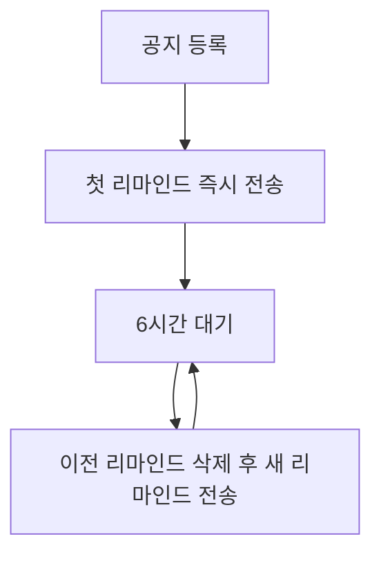
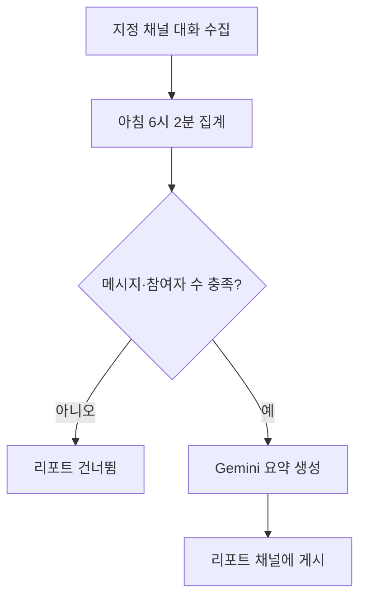

# eslee Discord Bot

Discord 서버의 공지 반복 알림, 금지어 관리, 하루 대화 요약을 자동화하는 서버 관리 봇입니다.

**문서 언어:** 한국어 · [English](README.en.md)

> 이 봇은 개인 서버용으로 운영 중이며 공개 초대 링크를 제공하지 않습니다.
> 사용하려면 [직접 배포하기](#직접-배포하기)를 따라 자신의 Discord 봇 애플리케이션으로
> 배포한 뒤, 그 봇을 자신의 서버에 초대하면 됩니다. GitHub의 소스 코드 ZIP은
> 바로 실행되는 설치 파일이 아닙니다.

## 이 봇으로 할 수 있는 일

- 중요한 공지가 채팅에 묻히지 않게 **6시간마다 다시 알리고** 싶을 때
- 이미 올린 메시지를 다시 쓰지 않고 **우클릭 한 번으로 공지로 등록**하고 싶을 때
- 금지어 수십 개를 **한 번에 등록**하고, `주.식`·`주 식`·`ㅈㅜㅅㅣㄱ`처럼
  **글자 사이를 벌리거나 자모를 나눈 우회 표현**까지 감지하고 싶을 때
- 메시지를 보낸 뒤 **수정해서 금지어를 넣는 경우**도 잡고 싶을 때
- 하루 동안 쌓인 대화를 **다음 날 아침 자동 요약 리포트**로 받고 싶을 때
- 봇이 재시작돼도 알림 일정과 요약 작업이 **처음부터 다시 시작되지 않길** 바랄 때

## 시작하기

봇을 배포하고 첫 공지를 등록하기까지의 전체 흐름입니다.

1. [직접 배포하기](#직접-배포하기)를 따라 봇을 실행합니다. 로컬 PC, Docker,
   Northflank 중 편한 방법을 고르면 됩니다.
2. Discord Developer Portal에서 만든 초대 링크로 봇을 서버에 초대합니다.
3. 서버 멤버 목록에서 봇이 **온라인**인지 확인합니다.
4. 채팅 입력창에 `/`를 입력해 `/공지`, `/금지어` 명령이 보이는지 확인합니다.
   초대 직후에는 명령이 나타나기까지 몇 분 걸릴 수 있습니다.
5. 관리자 계정으로 첫 기능을 시험합니다.
   - 아무 메시지나 우클릭(모바일은 길게 누르기) → **앱 → 공지로 등록**
   - 또는 `/금지어 추가`로 테스트 단어 하나를 등록한 뒤 그 단어를 보내 보기
6. `/설정 로그채널`로 관리 기록을 받을 채널을 지정하면 준비 끝입니다.

하루 대화 요약은 초대만으로는 켜지지 않는 선택 기능입니다. 봇을 배포하는
운영자가 환경변수로 대상 서버와 채널을 지정했을 때만 동작합니다.
자세한 내용은 [하루 대화 요약](#하루-대화-요약)을 참고하세요.

## 공지 리마인드

중요한 메시지를 원본 그대로 두고, 6시간마다 채널에 다시 알려 주는 기능입니다.

### 공지 등록하기

- 이미 올라온 메시지: 메시지를 우클릭하고 **앱 → 공지로 등록**을 선택합니다.
- 새로 작성: `/공지 등록`의 `content` 옵션에 공지 내용을 입력합니다.
  `channel` 옵션으로 원본 공지를 올릴 채널을 고를 수 있고, 비워 두면 명령을
  실행한 채널에 올라갑니다.

등록 직후 첫 리마인드가 바로 전송되고, 이후 6시간마다 반복됩니다.

### 리마인드가 동작하는 방식

- 새 리마인드가 올라올 때 **이전 리마인드만 삭제**합니다. 원본 공지 메시지는
  삭제하지도, 고정하지도 않습니다.
- 리마인드에는 원본으로 가는 링크가 항상 붙습니다. 짧은 글은 리마인드에서
  바로 읽을 수 있고, 긴 글은 미리보기로 줄여서 보여줍니다.
- 이미지와 파일은 다시 업로드하지 않고 원본 첨부파일로 안내합니다. 같은
  파일이 채널에 반복해서 쌓이지 않습니다.
- 원본 메시지를 수정하면 다음 리마인드부터 반영됩니다.
- 원본 메시지가 삭제되면 해당 공지는 자동으로 비활성화되고, 로그 채널이
  설정돼 있으면 알림이 남습니다.
- 봇이 꺼져 있던 동안 밀린 알림은 한꺼번에 보내지 않습니다. 공지마다 한 번만
  다시 알린 뒤 다음 정상 주기로 돌아갑니다.



### 투표(Poll) 공지

투표가 담긴 메시지를 공지로 등록하면 투표를 새로 만들지 않습니다. 투표를
복제하면 기존 참여 기록과 결과가 나뉘기 때문입니다. 대신 리마인드에 원본
투표의 질문, 진행 상태, 남은 시간을 보여주고 원본으로 이동하도록 안내합니다.
종료 시각이 지나면 `종료됨`으로 표시하고, 정확히 계산할 수 없는 참여자 수는
추측해서 보여주지 않습니다.

### 공지 관리

| 하고 싶은 일 | 명령 |
| --- | --- |
| 등록된 공지 확인 | `/공지 목록` |
| 지금 바로 다시 알리기 | `/공지 즉시전송` (자동완성으로 선택) |
| 공지 삭제 | `/공지 삭제` (자동완성으로 선택) |

## 금지어 관리

서버에서 쓰면 안 되는 단어를 등록해 두면, 새 메시지와 수정된 메시지를
실시간으로 검사합니다.

### 금지어 등록하기

- `/금지어 추가` — 한 개씩 등록합니다.
- `/금지어 일괄추가` — 쉼표 또는 줄바꿈으로 구분해 한 번에 최대 500개까지
  등록합니다. 예: `사과, 바나나, TEST`
- `/금지어 삭제` — 자동완성 목록에서 골라 삭제합니다.
- `/금지어 목록` — 현재 서버의 금지어를 확인합니다. **일반 멤버도 사용할 수
  있는 유일한 관리 명령**으로, 서버 규칙을 누구나 확인할 수 있게 하기
  위해서입니다. 등록할 수 있는 총 개수에는 제한이 없지만, 목록에는 처음
  100개까지만 표시되고 전체 등록 개수는 제목에 함께 나옵니다.

대소문자는 구분하지 않고, 같은 의미의 중복 입력은 자동으로 정리됩니다.

### 어떻게 감지하나요

기본 규칙은 단어 포함 검사입니다. `사과`를 등록하면 `청사과`, `사과나무`도
감지됩니다.

여기에 흔한 우회 표기도 함께 잡습니다. `주식`이 등록돼 있으면 `주.식`,
`주123식`, `주 식`, `주ㅋㅋ식`, 보이지 않는 특수문자 삽입, `ㅈㅜㅅㅣㄱ` 같은
자모 분리도 감지합니다. 다만 글자 사이에 허용되는 방해 문자는 공백·기호·
숫자·짧은 `ㅋ/ㅎ` 반복 정도로 제한되고 길이도 제한되기 때문에, `주말에 맛있는
식당에 갔다`처럼 사이에 실제 단어가 있는 정상 문장을 억지로 이어 붙여
오탐하지 않습니다.

봇과 Webhook이 보낸 메시지는 검사하지 않습니다. 봇 자신의 경고를 다시
감지하는 일이 없도록 하기 위해서입니다.

### 위반하면 어떻게 되나요

1. 위반 메시지를 삭제합니다.
2. 원래 채널에 작성자를 멘션한 경고를 띄우고 약 5초 뒤 자동 삭제합니다.
   DM은 보내지 않습니다.
3. `/설정 로그채널`로 지정한 채널이 있으면 사용자, 채널, 감지된 단어, 삭제
   성공 여부, 원문 미리보기가 관리자용 기록으로 남습니다.

한 메시지에 금지어가 여러 개 있어도 삭제와 경고는 한 번만 하고, 감지된
단어는 모두 기록합니다. 로그 채널이 없거나 봇이 접근할 수 없어도 감지와
삭제는 계속 동작합니다.

## 하루 대화 요약

지정한 채널의 하루 대화를 모아 다음 날 아침 Gemini로 요약 리포트를 만들어
주는 **선택 기능**입니다.

### 미리 알아둘 것

- 모든 서버에서 자동으로 켜지는 기능이 아닙니다. 봇 운영자가 환경변수로
  **한 서버의 한 채널**을 지정했을 때만 동작합니다.
- Google Gemini API 키가 필요하며, 대상 채널의 대화 내용이 요약을 위해
  Google Gemini로 전송됩니다.

### 어떻게 동작하나요

- 지정 채널에서 **사람이 작성한 텍스트만** 수집합니다. 봇, Webhook, 시스템
  메시지, 빈 메시지, 첨부파일만 있는 메시지는 제외합니다.
- 메시지를 수정하면 수정본이 반영되고, 삭제하면 요약 대상에서도 빠집니다.
- 매일 오전 6시 2분(기본값)에 전날 오전 6시부터 당일 오전 6시까지의 대화를
  집계합니다. 메시지 10개·참여자 2명(기본값) 이상일 때만 요약을 만듭니다.
- 리포트에는 전체 요약과 함께, 3개 이상 작성한 사용자 최대 20명(기본값)의
  한 줄 요약이 실립니다. 메시지 수, 참여자 수, 가장 활발한 시간대 같은
  통계는 봇이 직접 계산합니다.
- 완성된 리포트만 지정된 리포트 채널에 공개 게시됩니다.
- 봇이 재시작되면 놓친 메시지를 뒤로 돌아가 다시 읽고, 정각 실행을 놓쳤어도
  완료된 리포트가 없으면 자동으로 보충 실행합니다.
- 수집한 원문은 기본 3일 뒤 삭제되고, 생성된 리포트와 통계만 남습니다.



### 관리자 명령

아래 명령은 요약 대상으로 지정된 서버의 소유자·관리자만 사용할 수 있고,
응답은 실행한 사람에게만 보입니다.

| 명령 | 하는 일 |
| --- | --- |
| `/하루요약 상태` | 설정, 오늘 수집량, 최근 리포트 상태와 사용량 진단 확인 |
| `/하루요약 오늘` | 오늘 현재까지의 미리보기 리포트 생성 (`재생성` 옵션으로 갱신) |
| `/하루요약 어제` | 어제 리포트를 다시 게시. 완성본이 있으면 AI를 다시 호출하지 않고 그대로 복사 |
| `/하루요약 연결확인` | Gemini 인증과 모델 접근을 비공개로 점검. 키 값은 표시하지 않음 |

### 무료 사용량 안에서 동작합니다

짧은 하루 대화는 보통 **Gemini 요청 1회**로 요약이 끝납니다. 아주 긴 날은
대화를 나눠 요약한 뒤 합치며, 이때도 리포트 한 건이 쓸 수 있는 요청 수에
상한이 있습니다(자동 실행 기준 8회, 수동 실행까지 합쳐 12회). 요청이 실패하거나
무료 사용량을 초과해도 매분 다시 호출하지 않고 정해진 대기 시간 뒤에만
재시도하며, 사용량이 초기화되면 미완료 리포트를 자동으로 마저 만듭니다.
이미 성공한 요약 결과는 저장해 두었다가 재사용하므로 같은 작업에 사용량을
두 번 쓰지 않습니다. 그래서 사용량을 초과한 날은 리포트가 오후로 늦어질 수
있지만, 빠지지는 않습니다.

운영자용 환경변수와 세부 정책은 [일일 대화 요약 운영 가이드](docs/daily-summary.md)에
있습니다.

## 명령어 한눈에 보기

| 원하는 상황 | 명령 | 누가 쓸 수 있나요 |
| --- | --- | --- |
| 기존 메시지를 반복 공지로 | 우클릭 → **앱 → 공지로 등록** | 소유자·관리자 |
| 새 공지 작성 | `/공지 등록` | 소유자·관리자 |
| 공지 확인·삭제·즉시 전송 | `/공지 목록`·`삭제`·`즉시전송` | 소유자·관리자 |
| 금지어 한 개 추가 | `/금지어 추가` | 소유자·관리자 |
| 금지어 여러 개 추가 | `/금지어 일괄추가` | 소유자·관리자 |
| 금지어 삭제 | `/금지어 삭제` | 소유자·관리자 |
| 서버 금지어 확인 | `/금지어 목록` | **모든 멤버** |
| 관리 기록 채널 지정 | `/설정 로그채널` | 소유자·관리자 |
| 요약 상태·미리보기·재게시 | `/하루요약 상태`·`오늘`·`어제`·`연결확인` | 지정 서버의 소유자·관리자 + 운영자 설정 필요 |

"소유자·관리자"는 서버 소유자 또는 Discord의 관리자(Administrator) 권한을
가진 멤버를 뜻합니다. 관리 명령의 응답은 실행한 사람에게만 보이고, 권한이
없는 멤버가 실행하면 거부 안내만 받습니다. 봇 계정 자체에는 관리자 권한이
필요하지 않습니다.

## 꼭 알아둘 점

- 봇에게 채널 보기, 메시지 보내기, 메시지 관리, 메시지 기록 보기, 링크
  임베드 권한이 있어야 정상 동작합니다. 채널별 권한이 막혀 있으면 그 채널의
  삭제·알림이 실패할 수 있습니다.
- 금지어 감지에는 Discord Developer Portal의 **Message Content Intent**
  활성화가 필수입니다.
- 명령과 안내는 한국어입니다.
- 하루 대화 요약은 운영자가 지정한 한 서버·한 채널에서만 동작하며, Gemini
  API 키와 외부 API 연결이 필요합니다. 무료 사용량을 초과한 날은 리포트가
  늦어질 수 있습니다.
- 투표 공지는 원본 투표로 안내할 뿐 투표를 복제하지 않으므로, 투표 결과는
  항상 원본 한 곳에 모입니다.
- 하나의 봇 토큰으로 봇을 두 곳에서 동시에 실행하면 알림이 중복됩니다.
  실행 환경은 항상 하나만 유지하세요.
- Discord나 Google API 장애 시 알림과 리포트가 일시적으로 지연될 수
  있습니다.

## 데이터와 개인정보

봇이 저장하는 것:

- 서버별 설정(로그 채널), 공지 일정과 내용 스냅샷, 금지어 목록
- 금지어 위반 기록: 서버·사용자·채널 ID, 감지된 단어, 시각만 저장하고
  **메시지 원문은 저장하지 않습니다**
- 하루 요약 대상 채널의 메시지 텍스트: **기본 3일 보관 후 삭제**, 생성된
  리포트와 통계는 유지

채널에 표시되는 것:

- 금지어 위반 시 관리자 로그 채널에는 원문 미리보기가 표시됩니다. 로그
  채널은 관리자만 볼 수 있는 채널로 지정하는 것을 권장합니다.

외부로 전송되는 것:

- 하루 요약이 켜진 경우에만, 지정 채널의 메시지 텍스트·작성자 표시
  이름·작성 시각이 요약 생성을 위해 Google Gemini API로 전송됩니다.
  첨부파일은 수집 대상이 아니므로 전송되지 않습니다.
- 그 외 광고·분석 도구, 다른 외부 전송은 없습니다.

저장 위치는 운영자가 설정한 데이터베이스(로컬 SQLite 파일 또는
PostgreSQL)입니다. 실행 로그에는 토큰과 메시지 원문을 기록하지 않습니다.
문제 신고를 위해 로그를 공유할 때는 서버·채널·사용자 ID가 포함될 수 있으니
가리고 올리세요.

## 문제 해결

### Slash 명령이 보이지 않아요

→ 봇 초대 시 `bot`과 `applications.commands` 두 범위(scope)를 모두 포함했는지
확인하세요.
→ 초대 직후에는 전체 서버에 명령이 퍼지기까지 몇 분에서 최대 1시간쯤 걸릴 수
있습니다. Discord 앱을 재시작해 보세요.
→ 계속 안 보이면 봇을 추방하고 두 scope를 포함한 링크로 다시 초대하세요.

### 공지 리마인드가 오지 않아요

→ `/공지 목록`에서 공지가 아직 활성 상태인지 확인하세요. 원본 메시지가
삭제되면 공지는 자동 비활성화됩니다.
→ 봇이 해당 채널을 보고 메시지를 보낼 수 있는지 채널 권한을 확인하세요.
→ 봇이 온라인인지 확인하세요. 오프라인이었다면 밀린 알림은 한 번만 다시
전송됩니다.
→ 계속 실패하면 실행 로그에서 전송 오류를 확인하세요.

### 금지어가 감지되지 않아요

→ `/금지어 목록`으로 **현재 서버에** 등록돼 있는지 확인하세요. 금지어는
서버마다 따로 관리됩니다.
→ Developer Portal에서 Message Content Intent가 켜져 있는지 확인하세요.
→ 해당 메시지가 봇이나 Webhook이 보낸 것이라면 원래 검사 대상이 아닙니다.
→ 우회 표기 감지에는 범위 제한이 있습니다. 감지되길 원하는 변형이 있다면
그 형태를 금지어로 직접 추가하세요.

### 하루 요약 리포트가 올라오지 않아요

→ `/하루요약 상태`에서 기능 활성 여부, 오늘 수집량, 최근 리포트 상태와
사용량 진단을 먼저 확인하세요.
→ 어제 대화가 최소 기준(기본: 메시지 10개, 참여자 2명)에 못 미치면 리포트를
만들지 않는 것이 정상입니다.
→ `/하루요약 연결확인`으로 Gemini 키와 모델 접근을 점검하세요.
→ 무료 사용량을 초과한 날은 사용량이 초기화된 뒤 자동으로 보충 게시됩니다.
상태 명령에 대기 종료 시각이 표시됩니다.
→ 계속 실패하면 배포 환경(Northflank 등)의 실행 로그를 확인하세요.

### 데이터베이스 연결에 실패해요

→ `DATABASE_URL` 값을 확인하세요. `postgresql://`, `postgres://` 주소는
자동으로 비동기 드라이버 형식으로 변환되며 `sslmode=require`도 자동
처리됩니다.
→ Northflank라면 PostgreSQL Addon의 `POSTGRES_URI`가 `DATABASE_URL`이라는
이름(alias)으로 서비스에 연결돼 있는지 확인하세요.

### 봇이 오프라인이에요

→ 실행 환경(Northflank 배포 상태, 로컬 프로세스, Docker 컨테이너)이 실제로
실행 중인지 확인하세요.
→ 시작 로그에서 토큰 오류나 환경변수 검증 오류가 있는지 확인하세요. 필수
값이 잘못되면 봇은 시작 시 이유를 남기고 종료합니다.
→ 최신 코드가 배포됐는지, 인스턴스 수가 1인지 확인하세요.

## 작동 원리

- 공지 일정은 데이터베이스에 저장됩니다. 봇이 재시작돼도 6시간 주기가
  처음부터 다시 시작되지 않고, 저장된 다음 전송 시각을 그대로 따릅니다.
- 금지어 검사는 새 메시지와 수정된 메시지 이벤트에서 실행됩니다.
- 하루 요약은 지정 채널의 텍스트를 임시 저장해 두었다가 정해진 시각에
  집계하고, Gemini 요약이 중간에 실패해도 이미 완료된 부분은 저장해 두었다가
  이어서 진행합니다. 완료된 리포트는 다시 생성하지 않습니다.
- 서버별 데이터(공지, 금지어, 설정, 위반 기록)는 서버 단위로 분리되어 다른
  서버와 섞이지 않습니다.

## 직접 배포하기

여기서부터는 봇을 직접 실행하려는 운영자·개발자용 안내입니다.
Python 3.12 이상이 필요합니다.

### 1. 받기와 설치

```powershell
git clone https://github.com/esleeeeee/eslee-discord-bot.git
Set-Location eslee-discord-bot
python -m venv .venv
.venv\Scripts\Activate.ps1
python -m pip install -e ".[dev]"
Copy-Item .env.example .env
```

macOS/Linux에서는 `source .venv/bin/activate`와 `cp .env.example .env`를
사용합니다.

### 2. Discord Developer Portal 설정

1. [Discord Developer Portal](https://discord.com/developers/applications)에서
   새 애플리케이션을 만들고 **Bot** 탭에서 봇 토큰을 발급받습니다.
2. **Privileged Gateway Intents**에서 **Message Content Intent**를 켭니다.
   Presence와 Server Members Intent는 필요하지 않습니다.
3. 개인 운영이라면 **Public Bot**은 꺼 둡니다.
4. **OAuth2 → URL Generator**에서 `bot`과 `applications.commands` scope를
   선택하고, 아래 권한만 체크해 초대 링크를 만듭니다.
   - View Channels, Send Messages, Manage Messages,
     Read Message History, Embed Links
5. 만든 링크로 봇을 서버에 초대합니다. Administrator 권한은 주지 마세요.

### 3. 환경변수

`.env` 파일에 설정합니다. 실제 토큰과 키는 절대 Git에 올리지 마세요.
이 저장소는 `.env`, SQLite DB, 로그 파일을 Git에서 제외합니다.

```env
DISCORD_TOKEN=your_discord_bot_token
DATABASE_URL=sqlite+aiosqlite:///./data/eslee_bot.db
```

| 변수 | 필수 | 기본값 | 용도 | 민감정보 |
| --- | --- | --- | --- | --- |
| `DISCORD_TOKEN` | 필수 | — | 봇 토큰 | 예 |
| `DATABASE_URL` | 선택 | 로컬 SQLite 파일 | SQLite 또는 PostgreSQL 연결 주소 | PostgreSQL이면 예 |
| `LOG_LEVEL` | 선택 | `INFO` | 로그 레벨 | 아니오 |
| `SCHEDULER_POLL_SECONDS` | 선택 | `60` | 일정 확인 주기(10–300초) | 아니오 |
| `DISCORD_DEV_GUILD_ID` | 선택 | 없음 | 로컬 개발 전용: 명령을 즉시 반영할 테스트 서버 | 아니오 |
| `DAILY_SUMMARY_ENABLED` | 선택 | `false` | 하루 요약 기능 켜기 | 아니오 |
| `DAILY_SUMMARY_GUILD_ID` | 요약 사용 시 | 없음 | 요약 대상 서버 ID | 아니오 |
| `DAILY_SUMMARY_SOURCE_CHANNEL_ID` | 요약 사용 시 | 없음 | 대화를 수집할 채널 ID | 아니오 |
| `DAILY_SUMMARY_REPORT_CHANNEL_ID` | 요약 사용 시 | 없음 | 리포트를 게시할 채널 ID | 아니오 |
| `GEMINI_API_KEY` | 요약 사용 시 | 없음 | Google Gemini API 키 | 예 |
| `DAILY_SUMMARY_AI_MODEL` | 선택 | `gemini-3.5-flash` | 사용할 Gemini 모델 | 아니오 |
| `DAILY_SUMMARY_TIMEZONE` | 선택 | `Asia/Seoul` | 날짜 경계 시간대 | 아니오 |
| `DAILY_SUMMARY_RUN_TIME` | 선택 | `06:02` | 자동 리포트 시각(HH:MM) | 아니오 |
| `DAILY_SUMMARY_RAW_RETENTION_DAYS` | 선택 | `3` | 원문 보관 일수(1–30) | 아니오 |
| `DAILY_SUMMARY_MIN_TOTAL_MESSAGES` | 선택 | `10` | 리포트 최소 메시지 수 | 아니오 |
| `DAILY_SUMMARY_MIN_PARTICIPANTS` | 선택 | `2` | 리포트 최소 참여자 수 | 아니오 |
| `DAILY_SUMMARY_MIN_USER_MESSAGES` | 선택 | `3` | 개인 요약에 포함될 최소 작성 수 | 아니오 |
| `DAILY_SUMMARY_MAX_USERS` | 선택 | `20` | 개인 요약 최대 인원(1–100) | 아니오 |
| `ONEKEY_DISCORD_USER_ID` | 선택(쌍) | 없음 | OneKey API가 조회할 사용자 ID | 예 |
| `ONEKEY_API_TOKEN` | 선택(쌍) | 없음 | OneKey API 인증 토큰(공백 없이 32자 이상) | 예 |
| `PORT` | 선택 | `8080` | OneKey API HTTP 포트 | 아니오 |

`ONEKEY_DISCORD_USER_ID`와 `ONEKEY_API_TOKEN`은 반드시 함께 설정해야 하며,
토큰이 32자 미만이거나 앞뒤에 공백이 있으면 시작 시 거부됩니다.

### 4. 실행

```powershell
python -m eslee_bot
```

설치 과정에서 같은 봇을 실행하는 `eslee-bot` 명령도 함께 등록되므로,
`python -m eslee_bot` 대신 사용해도 됩니다.

첫 실행 시 `data/eslee_bot.db` SQLite 파일과 테이블이 자동 생성됩니다.
필수 환경변수가 잘못되면 비밀값을 노출하지 않는 오류 메시지와 함께
종료됩니다.

Windows 로그인 시 자동 실행이 필요하면 `scripts/install_scheduled_task.ps1`로
예약 작업을 만들 수 있습니다. 단, 같은 토큰을 다른 곳에서도 실행 중이면
알림이 중복되므로 로컬 전용 운영일 때만 사용하세요.

### 5. Docker로 실행

```powershell
Copy-Item .env.example .env
# .env에 토큰을 입력한 뒤
docker compose up --build -d
docker compose logs -f bot
```

컨테이너는 root가 아닌 전용 사용자로 실행되고, SQLite 데이터는 `bot-data`
볼륨에 보존됩니다.

### 6. Northflank에 배포

Northflank Developer Sandbox의 무료 서비스와 무료 PostgreSQL Addon으로
24시간 운영할 수 있습니다. 무료 정책은 바뀔 수 있으니
[요금 안내](https://northflank.com/docs/v1/application/billing/pricing-on-northflank)를
확인하세요.

1. 프로젝트를 만들고 무료 **PostgreSQL Addon**을 생성합니다.
2. **Secrets → Create secret group**에서 Addon을 연결하고, Addon의
   `POSTGRES_URI`를 정확히 `DATABASE_URL`이라는 별칭(alias)으로 지정합니다.
3. 같은 secret group에 `DISCORD_TOKEN`을 추가합니다. 하루 요약을 쓰려면
   `DAILY_SUMMARY_*`와 `GEMINI_API_KEY`도 여기에 추가합니다. 모두 build
   argument가 아닌 **runtime 변수**여야 합니다.
4. 이 저장소의 `main` 브랜치로 **Combined Service**를 만들고 build type을
   **Dockerfile**(경로 `/Dockerfile`), 인스턴스 수를 **1**로 설정합니다.
5. OneKey API를 쓰지 않는다면 포트 설정은 비워 둡니다. 쓴다면
   [OneKey 절](#7-onekey-음성-상태-api-선택)을 참고하세요.
6. 배포 로그에서 `Database initialized`와 Discord 로그인 메시지를
   확인합니다.

Northflank의 `postgresql://` 주소는 실행 시 자동으로 비동기 드라이버 형식으로
변환되고, `sslmode=require`도 알맞은 TLS 옵션으로 처리됩니다.

로컬 SQLite 데이터는 자동으로 이전되지 않습니다. 옮기려면
[SQLite → PostgreSQL 데이터 이전 가이드](docs/sqlite-to-postgres-migration.md)를
따르고, 이전 중에는 두 환경의 봇을 모두 중지하세요.

### 7. OneKey 음성 상태 API (선택)

같은 프로세스에서 실행되는 작은 HTTP API로, 지정한 사용자가 음성채널에
있는지 여부 하나만 알려줍니다. 제작자의 Windows 프로그램(eslee OneKey)이
게임 종료 후 오디오 장치를 되돌릴 시점을 판단하는 데 사용합니다.

- `GET /health` — 인증 없이 프로세스와 Discord 준비 상태를 반환
- `GET /api/voice-status` — `Authorization: Bearer <토큰>` 인증 후
  `{"in_voice": true|false}`만 반환. 어느 서버·채널인지는 알려주지 않습니다.

`ONEKEY_DISCORD_USER_ID`와 `ONEKEY_API_TOKEN`을 함께 설정하면 켜집니다.
Northflank에서는 `PORT`(기본 8080)를 HTTP public port로 노출하고 health
check 경로를 `/health`로 지정합니다. 봇이 없는 서버와 DM 통화는 감지할 수
없습니다.

### 8. 검사와 테스트

```powershell
python -m ruff check .
python -m pytest
```

GitHub Actions가 push와 pull request마다 같은 검사를 자동 실행합니다.

## 문서

- [일일 대화 요약 운영 가이드](docs/daily-summary.md) — 환경변수, 권한,
  개인정보, 사용량 정책, 장애 처리
- [SQLite → PostgreSQL 데이터 이전 가이드](docs/sqlite-to-postgres-migration.md)
- [CHANGELOG](CHANGELOG.md)
- 버그 신고와 제안: [GitHub Issues](https://github.com/esleeeeee/eslee-discord-bot/issues)

## 라이선스

[MIT License](LICENSE)
